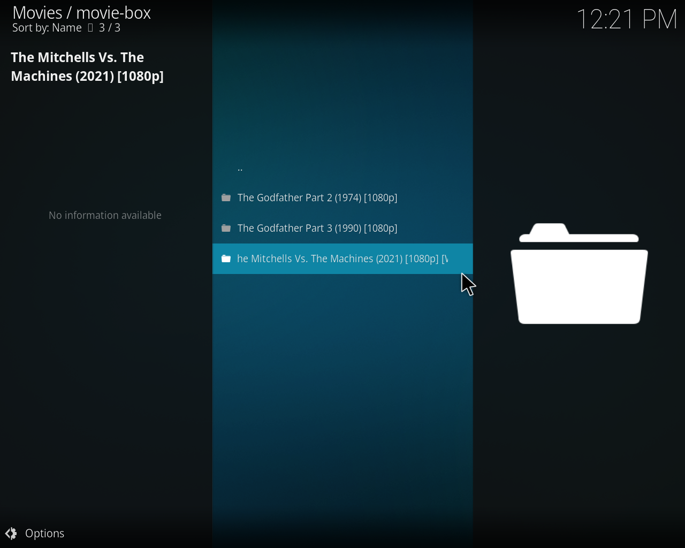
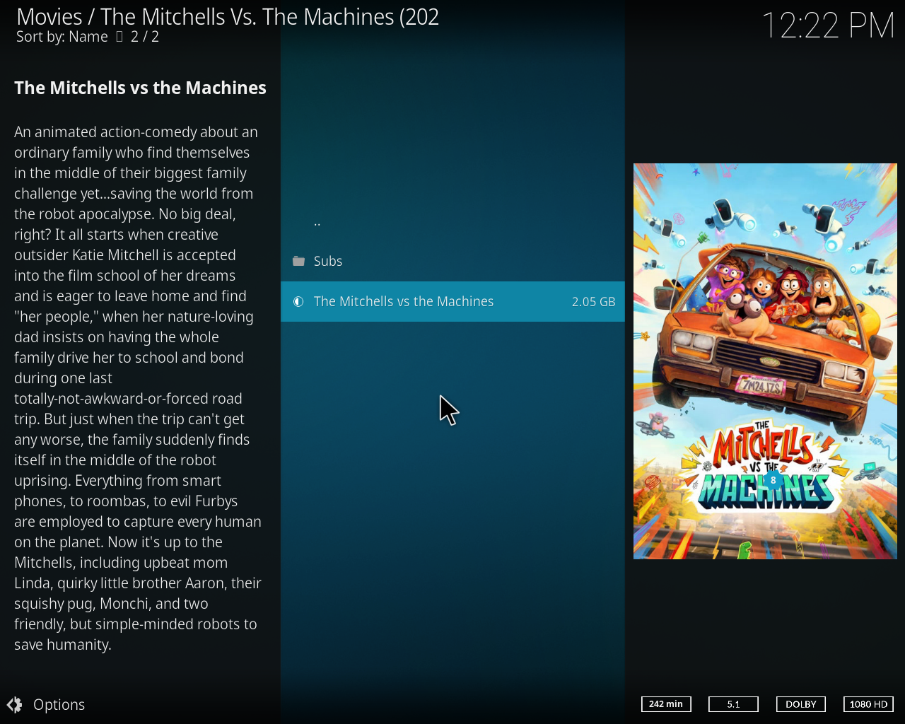

# Torrent-Box
<p align="center">

</p>

Download movie form [YTS](https://yts.mx/) without visiting to [YTS](https://yts.mx/api#list_movies) built top on [anacrolix/torrent](https://github.com/anacrolix/torrent) lib.

## Motivation

Most of the times, We are lazy people; to search good torrent. If you are found good torrent you have skipped few ads 
and ads blocker don't have any power in that station.  

## How to Install

```shell script
sudo wget https://github.com/sithumonline/movie-box/releases/download/v0.0.4/movie-box_0.0.4_linux_amd64 \
          -O /usr/local/bin/movie-box \
          && sudo chmod +x /usr/local/bin/movie-box
```

If your windows user now your start to think, Oh it's not for me... No! you're wrong. 
<!-- 
Windows have a very cool feature call [WSL](https://docs.microsoft.com/en-us/windows/wsl/install-win10).
Try WSL and go a head with it.
--->

_Note: If you face trouble try [WSL](https://docs.microsoft.com/en-us/windows/wsl/install-win10)._
## How to use

```shell script
movie-box get -n "name of the movie" -q 1080p -o "/path/to/download/directory"
```


### How to use with Docker

```shell script
docker run --rm -it ghcr.io/sithumonline/movie-box:0.0.4 \
       get -n "name of the movie" -q 720p -o "/path/to/download/directory"
```


# Torrent-Box-Server

Service for download movies form [YTS](https://yts.mx/) without visiting to [YTS](https://yts.mx/api#list_movies).

## Motivation

Do you have a deprecated laptop/pc or Raspberry Pi? Do you like to build your own media server?
and Watch movies from where ever you like? and Unable to enjoy Netflix.

## How to Install Server

You can install Server, following exactly the same  steps following what we used to install CLI above
without worrying about Docker or Kubernetes, and up the Server with `server` command except `get` command
like below. Basically, if you installed CLI you already installed Server.  

```shell script
movie-box server
```

_Note: If you like, You can set custom `volume path`._

### How to up Docker Container

_Note: movie-box Docker image support both for `amd64` and `arm` architectures._

```shell script
git clone https://github.com/sithumonline/movie-box
cd movie-box
docker-compose up
```

### How to Deploy on Kubernetes 

I highly recommend [K3s](https://k3s.io/) rather than Kubernetes or Minikube, if you are using a laptop/pc or Raspberry Pi. 

```shell script
sudo mkdir /movie-box
sudo kubectl apply -f https://raw.githubusercontent.com/sithumonline/movie-box/movie-box.yml
```

## How to use Server

### Download Movie

Open the web browser and go to

```
http://ip-add:port/move-box/name of the movie
```

_Note: `ip add` and `port` depend on method what you used to up your Server._


If you don't know what's the exact name of the movie, It will suggest the name of the movie.


### See Logs

Open the web browser and go to

```
http://ip-add:port/move-box
```


## How to set up Media Server

[Install Kodi Media](https://kodi.wiki/view/First_time_user) on the device that you run Server then 
[adding video sources to Kodi Media](https://kodi.wiki/view/Adding_video_sources) and give movie-box download
directory as the source. Don't forget to set `The Movie Database` as `information provider`.





 

